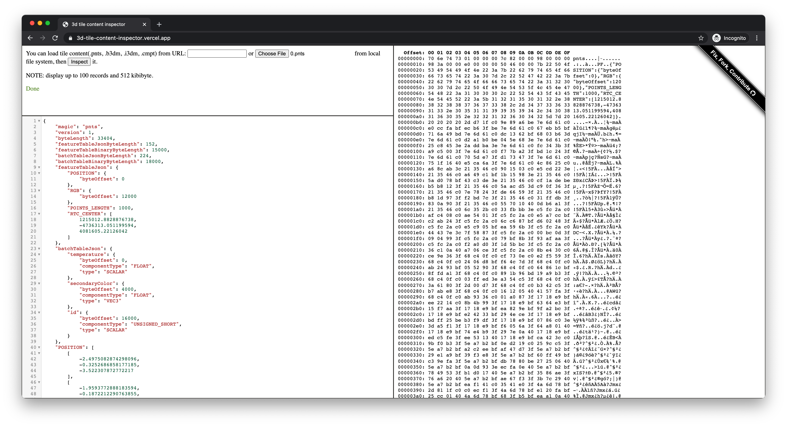

# 3D tile content inspector

[3D tile content](https://github.com/CesiumGS/3d-tiles/blob/master/specification/README.md#tile-format-specifications) inspector.

[](https://3d-tile-content-inspector.vercel.app/)

## Supported formats

- [x] .pnts
- [x] .b3dm
- [x] .i3dm
- [x] .cmpt
- [x] .glb
- [x] draco

## Dependencies

- Draco
- codemirror-5.59.4

See `src/thirdParty`.

## Development

Update submodule:

```bash
git submodule update --init --recursive
```

Lift development server:

```
npx http-server
```

Open `http://127.0.0.1:8080/src`.
